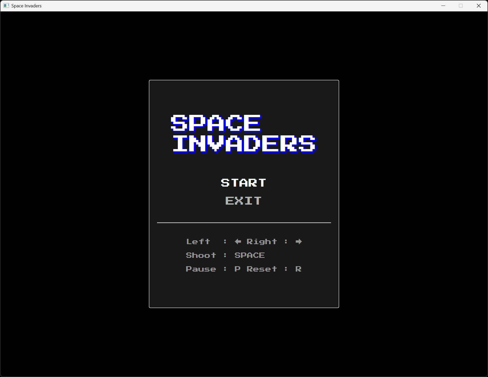
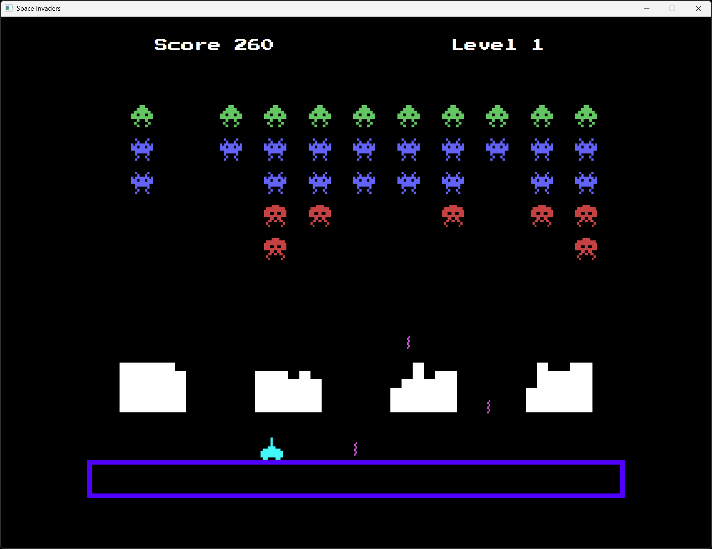

# Jeu du SpaceInvaders

## Présentation

Ce dépôt présente le projet du jeu SpaceInvaders mais ne fournit pas le code source complet du programme.
Je reste à l'écoute pour les personnes ayant des questions d'ordre général ou techniques.

## Description

L'objectif de ce projet est de fournir une implémentation fonctionnelle du jeu vidéo SpaceInvaders.

Les fonctionnalités sont les suivantes :

- Menu principal avec options START et EXIT
- Touche (P) pour PAUSE, (R) pour RESET
- Touches fléchées pour le déplacement du vaisseau
- Touche ESPACE pour le tir du vaisseau
- Quatre bunkers protecteurs pour le joueur
- Augmentation des tirs ennemis et de leur vitesse selon leur nombre
- Deux niveaux et un niveau de boss
- Effets sonores pour le tir du joueur et les déplacements ennemis

Le programme est écrit en Java.

## Aperçu

Exemple d'exécution du programme :

<table>
    <tr>
        <td></td>
        <td></td>
    </tr>
</table>

## Notes

Sur ce projet, on va retrouver les mêmes contraintes techniques que le Pong et le Snake ainsi
qu'une nouvelle qui est la notion de niveau. Par ailleurs, le gameplay, la gestion des collisions
sont ici un peu plus complexes à gérer. Le déplacement des ennemis et la gestion de leurs tirs
sont au centre du projet, c'est la partie intéressante selon moi. Le programme est plus
long à écrire que ceux évoqués.

## Auteur

© Charles Theetten. Tous droits réservés.

##
